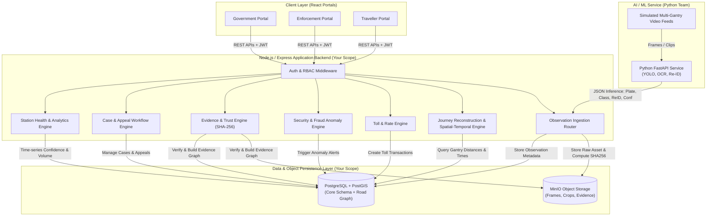
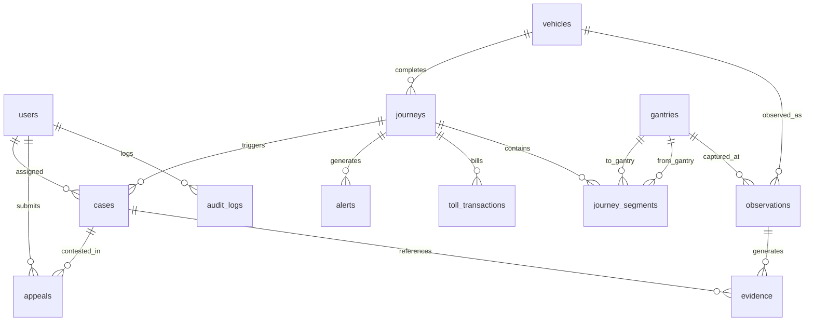
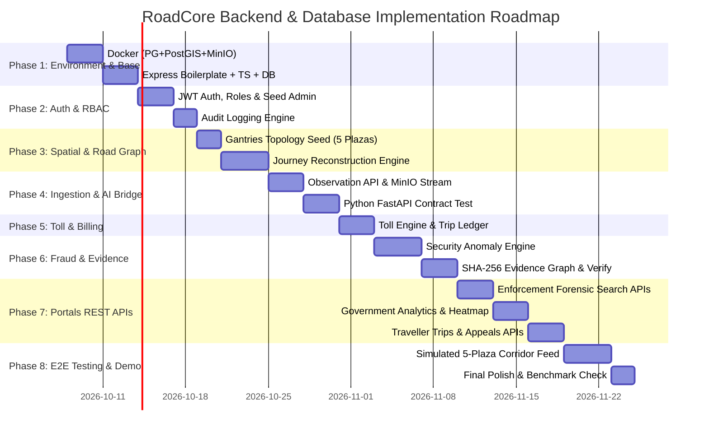

# RoadCore Backend & Database Implementation Plan
**Document Version:** 1.0  
**Project:** RoadCore — Intelligent Toll Integrity & Highway Intelligence Platform (BTP 5)  
**Developer Role:** Database & Node.js/Express Backend (Nishant)  
**Mentor:** Dr. Bhupendra Singh  
**Team Members:** Mayuresh, Omkar, Parth, Nishant, Pradnyesh  

---

## 1. Executive Summary & Scope of Responsibility

RoadCore acts as a software intelligence and trust layer on top of highway Multi-Lane Free Flow (MLFF) tolling. While the Python team handles computer vision (YOLO detection, OCR, vehicle attributes, TransReID) and the Frontend team builds the 3 React portals (Government, Enforcement, Traveller), **your responsibility as the Database & Node/Express Backend Developer is the central spine of the entire platform.**

### Your Core Responsibilities:
1. **Data Layer Architecture:** PostgreSQL relational schema + PostGIS geospatial extensions for highway topologies and gantry locations + MinIO (S3-compatible) object storage for evidence imagery.
2. **REST Application Server:** Express.js REST APIs with JWT authentication and strict Role-Based Access Control (`ADMIN`, `GOVERNMENT`, `ENFORCEMENT`, `TRAVELLER`).
3. **Observation Ingestion & AI Bridge:** High-throughput ingestion endpoint receiving observations, persisting metadata, saving frames/crops to MinIO, and interfacing with Python FastAPI.
4. **Spatial-Temporal Journey Reconstruction Engine:** Correlating multi-gantry camera events into coherent vehicle trips using PostGIS distance calculations, road-graph connectivity, and physical movement validation ($v = d / \Delta t$).
5. **Dynamic Toll & Rate Calculation Engine:** Calculating trip distance, class-based toll fees, and transaction ledgers.
6. **Security & Fraud Detection Engine:** Evaluating behavioral anomalies (speeding/impossible travel times, bypassed gantries, plate/vehicle-class mismatch, potential cloning) while strictly supporting the **"Insufficient Evidence"** state.
7. **Evidence & Trust Engine:** Computing SHA-256 cryptographic hashes on media and assembling tamper-evident evidence graphs for case files and e-notices.
8. **Enforcement Case Management & Traveller Appeals:** Lifecycle management for disputed notices, evidence presentation, and reviewer decisions.
9. **Corridor Health & Analytics Services:** Aggregating station OCR confidence degradation, traffic volume, and revenue leakage heatmaps.

---

## 2. System Architecture & Component Interaction



---

## 3. Database Architecture & Schema Design (PostgreSQL + PostGIS)

The database must be hosted on PostgreSQL (>= 15) with the `postgis` extension enabled.

### 3.1 Entity Relationship Diagram



### 3.2 SQL DDL Schema Specifications

```sql
-- Enable PostGIS and UUID generation
CREATE EXTENSION IF NOT EXISTS "uuid-ossp";
CREATE EXTENSION IF NOT EXISTS "postgis";

-- 1. USERS & AUTHENTICATION
CREATE TYPE user_role AS ENUM ('ADMIN', 'GOVERNMENT', 'ENFORCEMENT', 'TRAVELLER');
CREATE TYPE user_status AS ENUM ('ACTIVE', 'SUSPENDED', 'PENDING');

CREATE TABLE users (
    id UUID PRIMARY KEY DEFAULT uuid_generate_v4(),
    name VARCHAR(150) NOT NULL,
    email VARCHAR(255) UNIQUE NOT NULL,
    password_hash VARCHAR(255) NOT NULL,
    role user_role NOT NULL DEFAULT 'TRAVELLER',
    status user_status NOT NULL DEFAULT 'ACTIVE',
    phone VARCHAR(20),
    created_at TIMESTAMPTZ NOT NULL DEFAULT NOW(),
    updated_at TIMESTAMPTZ NOT NULL DEFAULT NOW()
);

-- 2. GANTRIES (Plazas / Highway Checkpoints)
CREATE TABLE gantries (
    id UUID PRIMARY KEY DEFAULT uuid_generate_v4(),
    code VARCHAR(50) UNIQUE NOT NULL, -- e.g., 'G-MUNDAKA-01'
    name VARCHAR(150) NOT NULL,       -- e.g., 'Mundaka Toll Plaza'
    highway VARCHAR(100) NOT NULL,    -- e.g., 'NH-48'
    km_marker NUMERIC(8, 2) NOT NULL, -- e.g., 42.50
    latitude NUMERIC(10, 7) NOT NULL,
    longitude NUMERIC(10, 7) NOT NULL,
    location GEOGRAPHY(Point, 4326),  -- PostGIS Geography Point
    direction VARCHAR(50) NOT NULL,   -- 'NORTHBOUND' / 'SOUTHBOUND'
    health_status VARCHAR(50) NOT NULL DEFAULT 'OPERATIONAL', -- 'OPERATIONAL', 'DEGRADED', 'OFFLINE'
    metadata JSONB DEFAULT '{}',
    created_at TIMESTAMPTZ NOT NULL DEFAULT NOW(),
    updated_at TIMESTAMPTZ NOT NULL DEFAULT NOW()
);

-- 3. VEHICLES (Known Master Registry & Identified Candidates)
CREATE TABLE vehicles (
    id UUID PRIMARY KEY DEFAULT uuid_generate_v4(),
    plate_number VARCHAR(20) UNIQUE NOT NULL, -- e.g., 'DL01AB1234'
    vehicle_type VARCHAR(50) NOT NULL,        -- 'CAR', 'SUV', 'BUS', 'TRUCK', 'LCV'
    color VARCHAR(50),
    make_model VARCHAR(100),
    registered_owner_id UUID REFERENCES users(id) ON DELETE SET NULL,
    fastag_id VARCHAR(100) UNIQUE,
    attributes JSONB DEFAULT '{}',            -- e.g., {"has_roof_rack": true, "sunroof": false}
    created_at TIMESTAMPTZ NOT NULL DEFAULT NOW(),
    updated_at TIMESTAMPTZ NOT NULL DEFAULT NOW()
);

-- 4. OBSERVATIONS (Raw Ingested Camera Detections)
CREATE TABLE observations (
    id UUID PRIMARY KEY DEFAULT uuid_generate_v4(),
    gantry_id UUID NOT NULL REFERENCES gantries(id) ON DELETE CASCADE,
    vehicle_id UUID REFERENCES vehicles(id) ON DELETE SET NULL,
    timestamp TIMESTAMPTZ NOT NULL,
    plate_text VARCHAR(20),
    plate_confidence NUMERIC(5, 4) NOT NULL,     -- 0.0000 to 1.0000
    vehicle_type VARCHAR(50),
    vehicle_color VARCHAR(50),
    reid_embedding JSONB,                        -- TransReID feature vector (optional float array)
    reid_confidence NUMERIC(5, 4),
    frame_image_uri VARCHAR(500) NOT NULL,       -- MinIO URI
    plate_crop_uri VARCHAR(500),                 -- MinIO URI
    sha256_hash CHAR(64) NOT NULL,               -- Integrity hash of frame
    metadata JSONB DEFAULT '{}',                 -- Lane number, camera ID, environmental conditions
    created_at TIMESTAMPTZ NOT NULL DEFAULT NOW()
);

-- 5. JOURNEYS (Reconstructed Trips across Gantries)
CREATE TYPE journey_status AS ENUM (
    'IN_PROGRESS', 
    'COMPLETED', 
    'FLAGGED_REVIEW', 
    'INSUFFICIENT_EVIDENCE', 
    'CLOSED'
);

CREATE TABLE journeys (
    id UUID PRIMARY KEY DEFAULT uuid_generate_v4(),
    vehicle_id UUID NOT NULL REFERENCES vehicles(id) ON DELETE CASCADE,
    entry_gantry_id UUID NOT NULL REFERENCES gantries(id),
    exit_gantry_id UUID REFERENCES gantries(id),
    entry_time TIMESTAMPTZ NOT NULL,
    exit_time TIMESTAMPTZ,
    distance_km NUMERIC(8, 2) NOT NULL DEFAULT 0.00,
    duration_minutes NUMERIC(8, 2),
    average_speed_kmh NUMERIC(8, 2),
    toll_amount NUMERIC(10, 2) NOT NULL DEFAULT 0.00,
    status journey_status NOT NULL DEFAULT 'IN_PROGRESS',
    evidence_status VARCHAR(50) DEFAULT 'NORMAL', -- 'NORMAL', 'DISPUTED', 'VERIFIED'
    created_at TIMESTAMPTZ NOT NULL DEFAULT NOW(),
    updated_at TIMESTAMPTZ NOT NULL DEFAULT NOW()
);

-- 6. JOURNEY SEGMENTS (Segment-level Spatio-Temporal Hops)
CREATE TABLE journey_segments (
    id UUID PRIMARY KEY DEFAULT uuid_generate_v4(),
    journey_id UUID NOT NULL REFERENCES journeys(id) ON DELETE CASCADE,
    from_gantry UUID NOT NULL REFERENCES gantries(id),
    to_gantry UUID NOT NULL REFERENCES gantries(id),
    distance_km NUMERIC(8, 2) NOT NULL,
    start_time TIMESTAMPTZ NOT NULL,
    end_time TIMESTAMPTZ NOT NULL,
    speed_kmh NUMERIC(8, 2) NOT NULL,
    validation_status VARCHAR(50) NOT NULL, -- 'PLAUSIBLE', 'SPEEDING', 'IMPOSSIBLE_SPEED', 'IRREGULAR_GAP'
    created_at TIMESTAMPTZ NOT NULL DEFAULT NOW()
);

-- 7. TOLL TRANSACTIONS (Financial Ledger)
CREATE TYPE transaction_status AS ENUM ('PENDING', 'CHARGED', 'FAILED', 'DISPUTED', 'WAIVED');

CREATE TABLE toll_transactions (
    id UUID PRIMARY KEY DEFAULT uuid_generate_v4(),
    journey_id UUID NOT NULL REFERENCES journeys(id) ON DELETE CASCADE,
    vehicle_id UUID NOT NULL REFERENCES vehicles(id),
    amount NUMERIC(10, 2) NOT NULL,
    base_rate_per_km NUMERIC(6, 2) NOT NULL,
    vehicle_class_multiplier NUMERIC(4, 2) NOT NULL DEFAULT 1.00,
    transaction_status transaction_status NOT NULL DEFAULT 'PENDING',
    payment_reference VARCHAR(100),
    e_notice_issued BOOLEAN DEFAULT FALSE,
    e_notice_id VARCHAR(100),
    timestamp TIMESTAMPTZ NOT NULL DEFAULT NOW()
);

-- 8. ALERTS & ANOMALIES (Security & Fraud Engine Detections)
CREATE TYPE alert_severity AS ENUM ('LOW', 'MEDIUM', 'HIGH', 'CRITICAL');
CREATE TYPE alert_status AS ENUM ('OPEN', 'UNDER_INVESTIGATION', 'RESOLVED', 'DISMISSED');

CREATE TABLE alerts (
    id UUID PRIMARY KEY DEFAULT uuid_generate_v4(),
    vehicle_id UUID REFERENCES vehicles(id) ON DELETE SET NULL,
    journey_id UUID REFERENCES journeys(id) ON DELETE SET NULL,
    alert_type VARCHAR(100) NOT NULL, -- 'BYPASS_DETECTED', 'IMPOSSIBLE_TRAVEL_TIME', 'PLATE_CLASS_MISMATCH', 'PLATE_CLONING_SUSPECTED'
    confidence NUMERIC(5, 4) NOT NULL,
    severity alert_severity NOT NULL DEFAULT 'MEDIUM',
    status alert_status NOT NULL DEFAULT 'OPEN',
    description TEXT NOT NULL,
    evidence_payload JSONB DEFAULT '{}',
    created_at TIMESTAMPTZ NOT NULL DEFAULT NOW(),
    updated_at TIMESTAMPTZ NOT NULL DEFAULT NOW()
);

-- 9. CASES (Forensic Investigation Files for Enforcement)
CREATE TYPE case_status AS ENUM ('NEW', 'IN_REVIEW', 'ENFORCEMENT_ISSUED', 'DISMISSED', 'APPEALED');

CREATE TABLE cases (
    id UUID PRIMARY KEY DEFAULT uuid_generate_v4(),
    case_number VARCHAR(100) UNIQUE NOT NULL, -- e.g., 'CASE-2026-00421'
    vehicle_id UUID REFERENCES vehicles(id),
    journey_id UUID REFERENCES journeys(id),
    alert_id UUID REFERENCES alerts(id),
    case_type VARCHAR(100) NOT NULL,
    status case_status NOT NULL DEFAULT 'NEW',
    assigned_to UUID REFERENCES users(id) ON DELETE SET NULL,
    investigator_notes TEXT,
    created_at TIMESTAMPTZ NOT NULL DEFAULT NOW(),
    updated_at TIMESTAMPTZ NOT NULL DEFAULT NOW()
);

-- 10. EVIDENCE (Cryptographic Asset Ledger)
CREATE TABLE evidence (
    id UUID PRIMARY KEY DEFAULT uuid_generate_v4(),
    case_id UUID REFERENCES cases(id) ON DELETE SET NULL,
    observation_id UUID REFERENCES observations(id) ON DELETE SET NULL,
    asset_uri VARCHAR(500) NOT NULL,
    sha256_hash CHAR(64) NOT NULL,
    evidence_type VARCHAR(50) NOT NULL, -- 'FRAME_SNAPSHOT', 'PLATE_CROP', 'JOURNEY_GRAPH', 'REID_SIMILARITY'
    captured_at TIMESTAMPTZ NOT NULL,
    created_at TIMESTAMPTZ NOT NULL DEFAULT NOW()
);

-- 11. APPEALS (Traveller Disputes & Secondary Reviews)
CREATE TYPE appeal_status AS ENUM ('SUBMITTED', 'UNDER_REVIEW', 'ACCEPTED', 'REJECTED');

CREATE TABLE appeals (
    id UUID PRIMARY KEY DEFAULT uuid_generate_v4(),
    case_id UUID REFERENCES cases(id) ON DELETE CASCADE,
    traveller_id UUID NOT NULL REFERENCES users(id),
    reason TEXT NOT NULL,
    traveller_proof_uri VARCHAR(500),
    status appeal_status NOT NULL DEFAULT 'SUBMITTED',
    reviewed_by UUID REFERENCES users(id),
    reviewer_decision_notes TEXT,
    submitted_at TIMESTAMPTZ NOT NULL DEFAULT NOW(),
    reviewed_at TIMESTAMPTZ
);

-- 12. AUDIT LOGS (Immutable Activity Log)
CREATE TABLE audit_logs (
    id UUID PRIMARY KEY DEFAULT uuid_generate_v4(),
    user_id UUID REFERENCES users(id) ON DELETE SET NULL,
    action VARCHAR(100) NOT NULL,        -- 'VIEW_EVIDENCE', 'VERIFY_HASH', 'UPDATE_CASE', 'SUBMIT_APPEAL'
    resource_type VARCHAR(100) NOT NULL, -- 'CASE', 'EVIDENCE', 'JOURNEY', 'USER'
    resource_id VARCHAR(100) NOT NULL,
    ip_address VARCHAR(50),
    metadata JSONB DEFAULT '{}',
    created_at TIMESTAMPTZ NOT NULL DEFAULT NOW()
);

-- 13. INDEXES FOR HIGH-THROUGHPUT PERFORMANCE
CREATE INDEX idx_observations_timestamp ON observations(timestamp);
CREATE INDEX idx_observations_plate ON observations(plate_text);
CREATE INDEX idx_observations_vehicle_id ON observations(vehicle_id);
CREATE INDEX idx_observations_gantry_id ON observations(gantry_id);
CREATE INDEX idx_journeys_vehicle_id ON journeys(vehicle_id);
CREATE INDEX idx_journeys_status ON journeys(status);
CREATE INDEX idx_gantries_location ON gantries USING GIST(location);
CREATE INDEX idx_alerts_status_severity ON alerts(status, severity);
CREATE INDEX idx_cases_status ON cases(status);
CREATE INDEX idx_audit_logs_timestamp ON audit_logs(created_at);
```

---

## 4. MinIO Object Storage Topology

To store evidence and video snapshots tamper-evidently:
- **Bucket: `roadcore-observations`**
  - Path: `raw-frames/{gantry_id}/{YYYY}/{MM}/{DD}/{observation_id}.jpg`
  - Path: `plate-crops/{gantry_id}/{YYYY}/{MM}/{DD}/{observation_id}_crop.jpg`
- **Bucket: `roadcore-evidence`**
  - Path: `cases/{case_id}/evidence_graph.json`
  - Path: `appeals/{appeal_id}/user_uploads/{filename}`

Every object stored into MinIO immediately has its SHA-256 digest calculated in Node.js buffer streaming and stored in the PostgreSQL `evidence` and `observations` tables.

---

## 5. Core Algorithmic Logic in Node.js

### 5.1 Spatial-Temporal Journey Reconstruction Algorithm
When a new observation $O_{new} = (G_{new}, T_{new}, P_{text}, Conf_{plate}, V_{attrs})$ arrives:
1. Search active journeys for vehicle $V$ where `status = 'IN_PROGRESS'` and `entry_time >= T_{new} - INTERVAL '6 HOURS'`.
2. **If no active journey exists:**
   - Create new journey with `entry_gantry_id = G_{new}`, `entry_time = T_{new}`, `status = 'IN_PROGRESS'`.
3. **If active journey exists:**
   - Retrieve the previous observation $O_{prev}$ from gantry $G_{prev}$ with timestamp $T_{prev}$.
   - Query road distance $d = \text{ST\_Distance}(G_{prev}.location, G_{new}.location)$ or highway $km\_marker$ delta $|km_{prev} - km_{new}|$.
   - Calculate time delta: $\Delta t = (T_{new} - T_{prev})$ in hours.
   - Calculate segment speed: $v_i = d_i / \Delta t_i$.
   - **Evaluate Physical Plausibility:**
     - If $v_i > 180 \text{ km/h}$: Flag as `IMPOSSIBLE_SPEED` or `SPEEDING`.
     - If $\Delta t_i$ is too long (e.g., vehicle took 4 hours for a 30-minute segment): Flag as `POTENTIAL_BYPASS_OR_STOPPAGE`.
     - Check graph connectivity: Did the vehicle skip 2 intermediate gantries? Flag as `BYPASSED_GANTRY`.
   - Record `journey_segments` entry.
   - Update journey: cumulative distance $D += d_i$, update `exit_gantry_id = G_{new}`, `exit_time = T_{new}`.
   - Calculate average speed $v_{avg} = D_{trip} / T_{trip}$.

### 5.2 Dynamic Toll & Rate Calculation
```javascript
function calculateToll(distanceKm, vehicleType) {
  const BASE_RATE_PER_KM = 2.15; // INR per km
  const MULTIPLIERS = {
    CAR: 1.0,
    SUV: 1.25,
    LCV: 1.8,
    BUS: 3.5,
    TRUCK: 4.2
  };
  const multiplier = MULTIPLIERS[vehicleType] || 1.0;
  return Number((distanceKm * BASE_RATE_PER_KM * multiplier).toFixed(2));
}
```

### 5.3 Security & Fraud Anomaly Engine (The 4 Rules)
1. **Rule A: Low AI Confidence Threshold (FR-12 "Insufficient Evidence")**
   - If $Conf_{plate} < 0.75$ and Re-ID similarity $< 0.70$:
   - Do **NOT** issue fraud alert.
   - Set Journey / Observation state to `INSUFFICIENT_EVIDENCE`.
   - Alert Type: `INSUFFICIENT_EVIDENCE_REVIEW`.
2. **Rule B: Plate-Vehicle Class Mismatch (Toll Evasion)**
   - Detected vehicle type is `TRUCK` or `BUS`, but Fastag or Plate registration is registered as `CAR`:
   - Raise `PLATE_CLASS_MISMATCH` alert with severity `HIGH`.
3. **Rule C: Ghost Vehicle / Cloning (Simultaneous Gantry Presence)**
   - Observation $O_1$ at Gantry A (Mundaka) at 14:10.
   - Observation $O_2$ at Gantry B (Choryasi - 200 km away) at 14:25.
   - Segment speed $v > 800 \text{ km/h}$.
   - Raise `PLATE_CLONING_SUSPECTED` alert with severity `CRITICAL`.
4. **Rule D: Missing Gantry Bypass**
   - Expected path: Mundaka $\to$ Choryasi $\to$ Gharaunda.
   - Observations recorded at Mundaka and Gharaunda, but completely absent at Choryasi.
   - Raise `SUSPECTED_ROUTE_BYPASS` alert with severity `MEDIUM`.

### 5.4 Tamper-Proof SHA-256 Verification
```javascript
import crypto from 'crypto';

export function computeSha256(buffer) {
  return crypto.createHash('sha256').update(buffer).digest('hex');
}

export function verifyEvidenceIntegrity(storedHash, fileBuffer) {
  const currentHash = computeSha256(fileBuffer);
  return {
    verified: storedHash === currentHash,
    storedHash,
    currentHash
  };
}
```

---

## 6. Comprehensive Phase-Wise Implementation Roadmap



### Phase 1: Foundation, Infrastructure & Database Setup
- **Objective:** Provision all persistence services in Docker and initialize the TypeScript/Express workspace.
- **Tasks:**
  1. Create `docker-compose.yml` defining:
     - PostgreSQL 16 with PostGIS (`postgis/postgis:16-3.4`).
     - MinIO server with console access (`minio/minio`).
  2. Initialize Node.js TypeScript project (`package.json`, `tsconfig.json`, `eslint`).
  3. Set up ORM/Query builder (Prisma with PostGIS support or Kysely / `node-postgres`).
  4. Write and apply initial database migrations for all tables defined in Section 3.
  5. Configure S3/MinIO client library in Node (`@aws-sdk/client-s3` or `minio`).
- **Deliverables:** Docker stack boots cleanly, tables created with PostGIS spatial indices, health check route `GET /api/health` returns status `200`.

### Phase 2: Authentication, Role-Based Access Control & Audit Logging
- **Objective:** Secure the platform and establish non-repudiable audit logs.
- **Tasks:**
  1. Build `auth.controller.ts` with bcrypt password hashing and JWT issuance (access + refresh tokens).
  2. Implement `authenticate` and `authorize(...roles)` middlewares.
  3. Create seed script to create initial test accounts for all four roles:
     - `admin@roadcore.gov.in` (`ADMIN`)
     - `nhai.officer@roadcore.gov.in` (`GOVERNMENT`)
     - `inspector.sharma@roadcore.gov.in` (`ENFORCEMENT`)
     - `user.traveller@gmail.com` (`TRAVELLER`)
  4. Create `audit.service.ts` to log any sensitive view, case edit, or appeal action into `audit_logs`.
- **Deliverables:** Working `/api/auth/login`, `/api/auth/refresh`, RBAC guard tests.

### Phase 3: Highway Road Graph & Spatial-Temporal Reconstruction Engine
- **Objective:** Establish the corridor topology and reconstruct multi-gantry journeys.
- **Tasks:**
  1. Seed the 5 operational MLFF plazas from Section 20 of SRS:
     - Mundaka (km 0.0)
     - Choryasi (km 65.2)
     - Gharaunda (km 110.8)
     - Daulatpura (km 178.4)
     - Manoharpura (km 245.0)
  2. Implement spatial query utilities to calculate road distance and highway order.
  3. Build `journey.service.ts`:
     - Multi-gantry chaining logic using vehicle plate/id and sliding time-window.
     - Calculate segment speed $v_i = d_i / \Delta t_i$ and journey speed $v_{avg}$.
     - Flag spatial-temporal violations (impossible speeds, backwards hops).
- **Deliverables:** Unit tests verifying that sequential gantry timestamps correctly build a connected journey with calculated distances and speeds.

### Phase 4: Observation Ingestion & Python AI Service Bridge
- **Objective:** High-throughput observation ingestion and image/evidence persistence.
- **Tasks:**
  1. Implement `POST /api/observations` accepting:
     - `gantry_id`, `timestamp`, `plate_text`, `plate_confidence`, `vehicle_type`, `vehicle_color`, `reid_confidence`, plus multipart frame/crop images or base64.
  2. Compute SHA-256 hash immediately upon receiving image streams.
  3. Upload raw frame and cropped plate to MinIO.
  4. Upsert vehicle record in `vehicles` table.
  5. Save observation to `observations` table with the MinIO URI and SHA-256 hash.
  6. Trigger the Journey Reconstruction hook asynchronously.
  7. Provide a simulation test mock for the Python FastAPI service so your backend can be tested without waiting on Python teammates.
- **Deliverables:** Ingestion endpoint processes simulated camera payloads, verifies images in MinIO, and records observations with SHA-256 hashes.

### Phase 5: Toll Calculation, Dynamic Pricing & Billing Ledger
- **Objective:** Automated billing calculation based on vehicle class and traversed distance.
- **Tasks:**
  1. Implement toll calculation engine with rate table per vehicle class.
  2. Generate `toll_transactions` record when journey reaches completion or exit gantry.
  3. Expose traveller ledger endpoints: `GET /api/traveller/trips`, `GET /api/traveller/notices`.
- **Deliverables:** Accurate distance-based toll computation and trip ledgers.

### Phase 6: Fraud & Anomaly Engine + "Insufficient Evidence" State Machine
- **Objective:** Implement the security analysis logic and tamper-evident proof graphs.
- **Tasks:**
  1. Implement rule-based anomaly detection:
     - Missing intermediate gantry (route bypass).
     - Segment speed $> 180 \text{ km/h}$ or impossible travel times.
     - Plate/vehicle class mismatch (e.g., Heavy truck with Car plate/tag).
  2. Implement **FR-12 Insufficient Evidence state machine**:
     - When plate confidence is below configurable threshold (e.g., $< 0.75$), set observation and journey state to `INSUFFICIENT_EVIDENCE`.
     - Prevent automated fine issuance; trigger review-needed queue instead.
  3. Build Evidence Graph service:
     - Generates structured JSON graph connecting Vehicle $\to$ Observations $\to$ Frames $\to$ Timestamps $\to$ Route $\to$ Hashes.
  4. Implement `POST /api/evidence/verify` that downloads the MinIO asset, recomputes SHA-256, and compares with DB stored hash.
- **Deliverables:** Automated anomaly flagging with explainable evidence graphs and hash verification tests.

### Phase 7: Portal-Specific REST APIs
- **Objective:** Build dedicated APIs for each of the 3 portals.
- **Tasks:**
  1. **Government Portal APIs (`/api/dashboard/*`):**
     - `GET /api/dashboard/traffic`: Hourly and daily corridor volume.
     - `GET /api/dashboard/revenue`: Expected vs collected toll, leakage percentage (tracking the ~9.5% baseline).
     - `GET /api/dashboard/leakage`: GeoJSON heatmap coordinates of suspected bypass exits.
     - `GET /api/dashboard/station-health`: ANPR confidence moving averages per gantry, alerting if dropping below 80%.
  2. **Enforcement Portal APIs (`/api/enforcement/*`):**
     - `GET /api/search/forensic`: Multi-attribute search (plate fuzzy search, vehicle type, color, date range, gantry).
     - `GET /api/cases`, `POST /api/cases`, `GET /api/cases/:id`, `PATCH /api/cases/:id`.
  3. **Traveller Portal APIs (`/api/traveller/*`):**
     - `GET /api/traveller/trips`: Authenticated user trip history.
     - `POST /api/traveller/appeals`: Submit dispute against an e-notice with user explanation and uploaded proof.
     - `GET /api/appeals/:id`: Check appeal status and reviewer feedback.
- **Deliverables:** Complete, fully documented REST API suite consumed by the React frontend team.

### Phase 8: End-to-End Simulation, Testing & Demonstration Readiness
- **Objective:** Validate the complete software pipeline using simulated multi-gantry video sequences.
- **Tasks:**
  1. Write a CLI seed simulator script `npm run simulate:corridor`:
     - Emulates 3 test vehicles driving across the 5 plazas (Mundaka $\to$ Choryasi $\to$ Gharaunda $\to$ Daulatpura $\to$ Manoharpura).
     - Vehicle 1: Normal compliant trip (clean journey, paid toll).
     - Vehicle 2: Speeding & bypassed gantry (anomaly flagged, case created).
     - Vehicle 3: Blurred/rainy plate (low confidence $\to$ Insufficient Evidence state).
     - Vehicle 4: Cloned plate (identical plate detected at distant gantries at impossible speeds).
  2. Write automated integration tests (Supertest + Jest/Vitest).
  3. Prepare postman/Bruno API collection with environment presets.
- **Deliverables:** 100% passing test suite and automated demonstration script ready for the project mentor evaluation.

---

## 7. Complete API Endpoint Specification Table

| Method | Endpoint | Access Role | Description |
|---|---|---|---|
| **POST** | `/api/auth/login` | Public | Authenticates user; returns JWT token + role |
| **POST** | `/api/auth/refresh` | Public | Refreshes expired access token |
| **GET** | `/api/auth/me` | Authenticated | Gets current user profile |
| **POST** | `/api/observations` | System/AI | Ingests camera detection event, hashes frame, uploads to MinIO |
| **GET** | `/api/observations/:id` | Enforcement, Gov | Retrieves single observation details & image URLs |
| **GET** | `/api/gantries` | Authenticated | Lists all gantries with coordinates and health status |
| **GET** | `/api/journeys` | Enforcement, Gov | Lists journeys with filtering by status and date |
| **GET** | `/api/journeys/:id` | Enforcement, Gov | Retrieves journey details, segments, and speed calculations |
| **POST** | `/api/journeys/reconstruct` | Admin | Triggers batch journey reconstruction |
| **GET** | `/api/alerts` | Enforcement, Gov | Lists fraud/anomaly alerts |
| **PATCH** | `/api/alerts/:id` | Enforcement | Updates alert status (`RESOLVED`, `UNDER_INVESTIGATION`) |
| **GET** | `/api/cases` | Enforcement | Lists forensic cases |
| **POST** | `/api/cases` | Enforcement | Manually creates an enforcement case from an alert |
| **GET** | `/api/cases/:id` | Enforcement | Retrieves full case file, timeline, and linked evidence graph |
| **PATCH** | `/api/cases/:id` | Enforcement | Updates case decision and investigator notes |
| **GET** | `/api/evidence/:id` | Enforcement | Gets evidence metadata |
| **POST** | `/api/evidence/verify` | Enforcement | Recomputes SHA-256 against stored asset and verifies integrity |
| **GET** | `/api/traveller/trips` | Traveller | Returns logged-in traveller's trips and toll fees |
| **GET** | `/api/traveller/notices` | Traveller | Returns e-notices and unpaid toll penalty notices |
| **POST** | `/api/traveller/appeals` | Traveller | Submits a dispute against an e-notice |
| **GET** | `/api/appeals/:id` | Traveller, Enf | Gets status and notes of an appeal |
| **PATCH** | `/api/appeals/:id` | Enforcement | Accepts or rejects an appeal |
| **GET** | `/api/dashboard/traffic` | Government, Admin | Aggregated vehicle traffic counts over time |
| **GET** | `/api/dashboard/revenue` | Government, Admin | Financial summary: collected, unpaid, leakage rate |
| **GET** | `/api/dashboard/leakage` | Government, Admin | GeoJSON points/paths of suspected bypasses |
| **GET** | `/api/dashboard/station-health` | Government, Admin | Average OCR confidence and camera operational status |
| **GET** | `/api/search/forensic` | Enforcement | Multi-attribute progressive vehicle search |

---

## 8. Corridor Seed Data (5 Operational Plazas)

Based on Section 20 of the RoadCore specification, use these exact real-world baseline plazas for database seeding:

```json
[
  {
    "code": "G-MUNDAKA-01",
    "name": "Mundaka Toll Plaza",
    "highway": "Western Peripheral Expressway",
    "km_marker": 0.0,
    "latitude": 28.6833,
    "longitude": 76.9950,
    "direction": "SOUTHBOUND"
  },
  {
    "code": "G-CHORYASI-02",
    "name": "Choryasi Toll Plaza",
    "highway": "NH-48",
    "km_marker": 65.2,
    "latitude": 28.2450,
    "longitude": 76.8120,
    "direction": "SOUTHBOUND"
  },
  {
    "code": "G-GHARAUNDA-03",
    "name": "Gharaunda Toll Plaza",
    "highway": "NH-44",
    "km_marker": 110.8,
    "latitude": 29.5412,
    "longitude": 76.9734,
    "direction": "NORTHBOUND"
  },
  {
    "code": "G-DAULATPURA-04",
    "name": "Daulatpura Toll Plaza",
    "highway": "NH-52",
    "km_marker": 178.4,
    "latitude": 27.0652,
    "longitude": 75.7610,
    "direction": "SOUTHBOUND"
  },
  {
    "code": "G-MANOHARPURA-05",
    "name": "Manoharpura Toll Plaza",
    "highway": "NH-48",
    "km_marker": 245.0,
    "latitude": 27.2912,
    "longitude": 75.9520,
    "direction": "SOUTHBOUND"
  }
]
```

---

## 9. Immediate Next Steps for Nishant

1. **Step 1:** Create `docker-compose.yml` for PostgreSQL 16 (PostGIS) and MinIO in the workspace.
2. **Step 2:** Initialize the Node.js backend workspace with TypeScript, Express, and Prisma / Kysely.
3. **Step 3:** Apply the SQL schema migrations to create the 12 core tables and spatial indices.
4. **Step 4:** Execute the corridor seed script to populate the 5 MLFF plazas and test users.
5. **Step 5:** Provide the OpenAPI / Swagger documentation to the Frontend and AI teammates.
